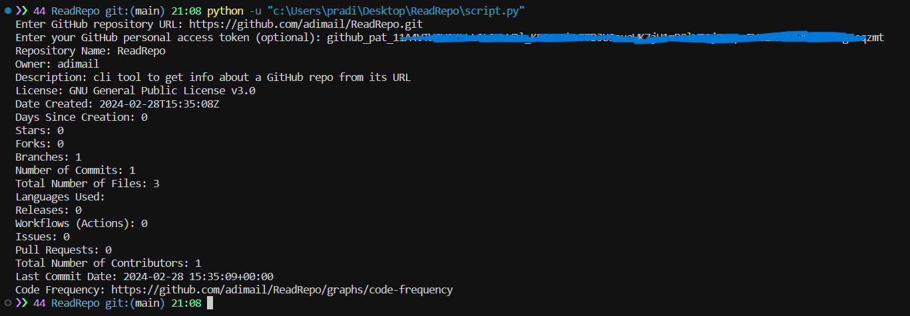

# ReadRepo

cli tool to get info about a GitHub repo from its URL

# Screenshot

## Steps to Generate an Access Token in GitHub

1. Access Account Settings: Click on your profile icon at the top right corner and select "Settings".
1. Navigate to Developer Settings: In the settings page, choose "Developer settings" from the left sidebar.
1. Select Personal Access Tokens: Within Developer settings, select "Personal access tokens".
1. Generate New Token: Click on "Generate new token". You may need to enter your password for verification.
1. Generate Token: Click "Generate token" at the bottom of the page.
1. Copy Token: GitHub will display your new access token. Copy it immediately.
